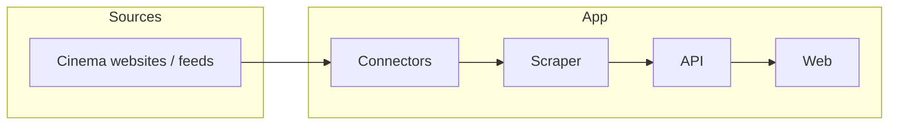

# CinePosto

Scraper, API, and web app for Umbria cinema showtimes (.NET + Azure).

## Overview

CinePosto collects cinema schedules in Umbria and exposes them
through an API with a web frontend.

TODO: add a one-paragraph project summary once the scope is final.

## Project status

Early stage. The repository layout is in place; implementation
has not started yet.

- [x] Repository structure
- [ ] Domain model — TODO
- [ ] First cinema connector — TODO
- [ ] Scraper — TODO
- [ ] API — TODO
- [ ] Web frontend — TODO
- [ ] Azure deployment (Bicep + GitHub Actions) — TODO

## Architecture

TODO: describe the layers (Domain, Infrastructure, Connectors,
Scraper, Api, Web) once implemented.



## Repository structure

```text
src/      # .NET projects (Domain, Infrastructure, Connectors, Scraper, Api, Web) — TODO
tests/    # automated tests with saved fixtures (no live network) — TODO
docs/     # analysis, UX, and architecture notes
infra/    # Bicep files for Azure deployment — TODO
.github/  # GitHub Actions workflows and templates
```

See `AGENTS.md` for working rules (branches, commits, tests, secrets).

## Getting started

Prerequisites: TODO (exact .NET SDK version).

```bash
dotnet build
dotnet test
```

TODO: add run instructions for the API and web app once they exist.

Configuration uses environment variables. Production secrets live
in Azure Key Vault. Never commit secrets to the repo.

## Roadmap

- TODO: define milestones (first connector, API v1, web v1, Azure deploy).
- TODO: list target cinemas.

## License

MIT. See [LICENSE](LICENSE).
